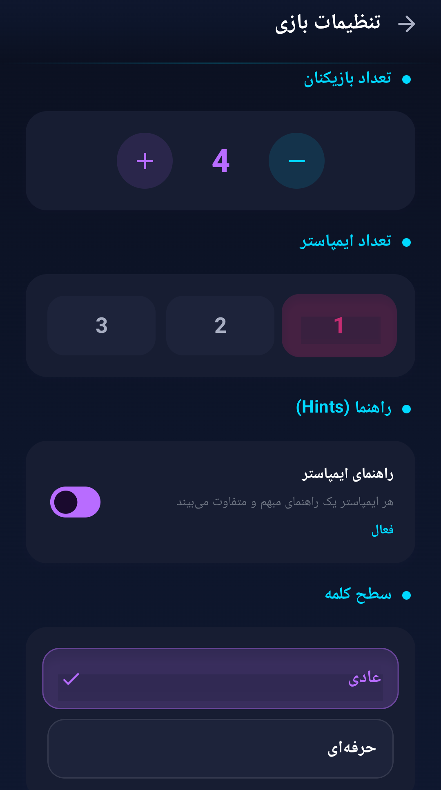
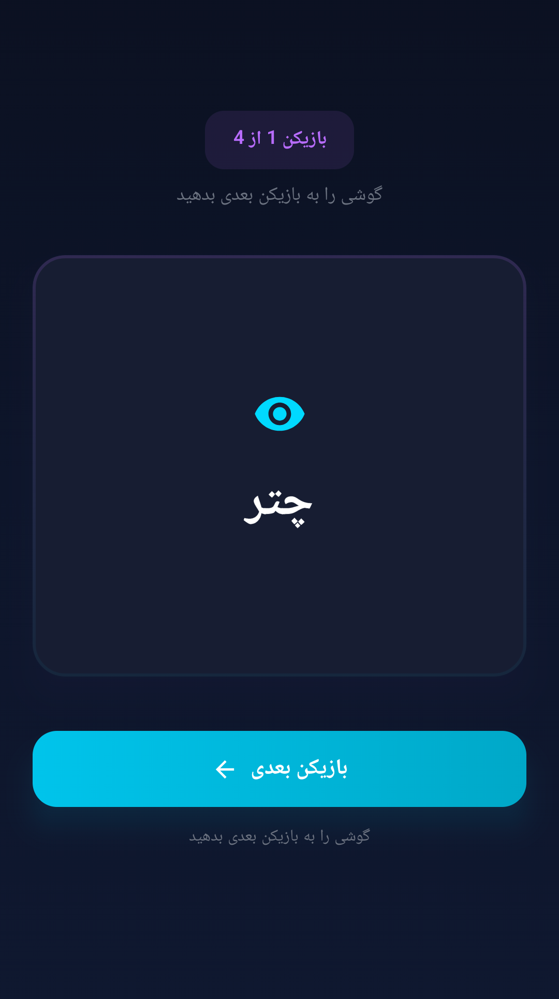
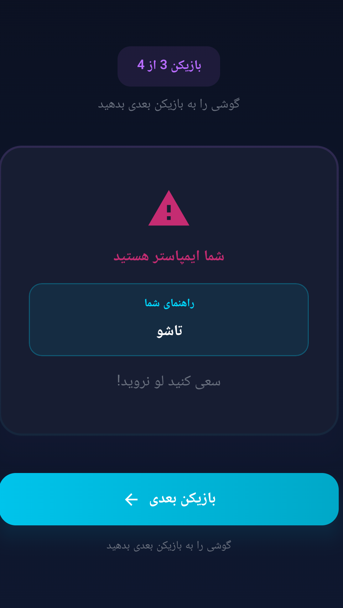
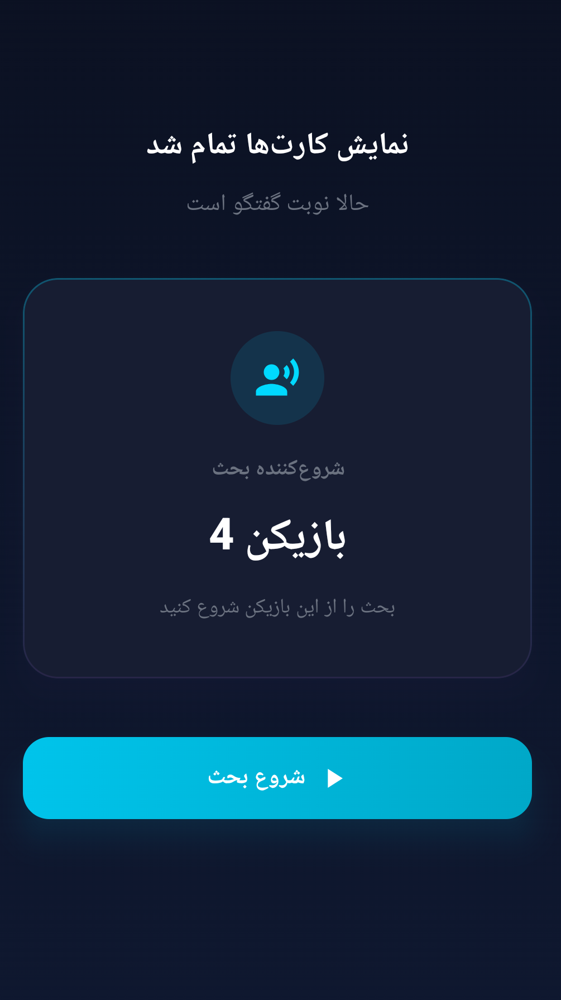

# Imposter

A modern party game for Android: pass the phone around, each player secretly
checks their role card, and the table has to find the imposter hiding among
them. The user interface is in Persian (Farsi).

The app is **offline-first** — every word lives in a local Room database, with
no network permission, no accounts, and no ads.

## Features

- **3–9 players** per game
- **1–3 imposters** per game (imposters are always fewer than players)
- **2 word types**, built around word *structure*, not topic:
  - **Normal (عادی)**: one standalone word (e.g. «کتاب»)
  - **Pro (حرفه‌ای)**: a natural two-part compound (e.g. «ماشین لباسشویی»)
  - A curated **160-word Persian bank** (80 words per type); the active type
    is chosen at setup
- **Hints for imposters**: when enabled, every imposter receives their own
  unique, deliberately vague one-word hint tied to the secret word; hints can
  be turned off entirely for a harder game
- **Fully randomized setup** (`StartGameUseCase`):
  - the secret word is picked randomly and recently used words are avoided,
  - imposters are assigned randomly,
  - hint assignment order is shuffled every round, so each imposter gets a
    different hint in a different order each game,
  - the discussion starting player is picked at random
- **Card-flip reveal**: players pass the phone and tap to flip their card —
  citizens see the word, imposters see no word (only their hint, when enabled)
- **Discussion start screen** that announces who opens the discussion and then
  clears game state so nothing leaks into the next round
- **Rules screen** explaining the full round (setup, roles, discussion,
  voting and winning conditions), plus **About** and **Settings** screens
- **Dark Material 3 design** — a dark navy background with purple/cyan/pink
  gradients, glow accents and animated screen transitions
- **Offline-first**: all word data lives in a local Room database

## How to Play

1. **Home** — start a new game, read the rules, or open About/Settings.
2. **Setup** — choose the number of players (3–9), the number of imposters
   (1–3), the word type (Normal/Pro), and whether imposters get hints.
3. **Player cards** — pass the phone around. Each player taps to flip their
   private card:
   - **Citizens** see the secret word.
   - **Imposters** see that they are the imposter — but not the word. With
     hints enabled they receive their own unique one-word hint instead.
4. **Discussion start** — the phone announces a randomly chosen starting
   player; the game state is then cleared.
5. **Discussion & voting** — played around the table (the app explains the
   rules on the Rules screen): everyone talks, then votes. Citizens win if the
   imposter gets caught; the imposter wins by blending in until the end.
6. **Finished** — a summary screen returns the players to the home menu.

The app handles everything up to the discussion; talking, bluffing and voting
happen between the players.

## Tech Stack

- **Kotlin** 2.1
- **Jetpack Compose** (Material 3) with Compose Navigation and animations
- **Room** 2.8 (KSP) for the local word database
- **Kotlin Coroutines & Flow** + **ViewModel** for state management
- **Android Gradle Plugin** 9.2.1, Gradle 9.4.1 (Kotlin DSL + version catalog)
- **minSdk 24 / targetSdk 36 / compileSdk 36**, no external permissions

## Project Structure

```
Imposter/
├── app/                              # Android application module
│   └── src/
│       ├── main/
│       │   ├── java/ir/mehdi/imposter/
│       │   │   ├── data/             # Room database, DAO, entities, repositories
│       │   │   │   └── local/SeedData.kt   # The 160-word Persian dataset
│       │   │   ├── domain/           # Models, repository interfaces, use cases
│       │   │   │   ├── model/        # GameConfig, WordType, GameState, PlayerCard, Word
│       │   │   │   └── usecase/      # StartGameUseCase, GetWordsByTypeUseCase
│       │   │   ├── presentation/     # Screens, navigation, theme
│       │   │   │   ├── navigation/   # NavGraph + Screen sealed routes
│       │   │   │   ├── screen/       # home / setup / player / discussion /
│       │   │   │   │                 #   finished / rules / about / settings
│       │   │   │   └── theme/        # Dark Color.kt + gradient brushes
│       │   │   ├── ImposterApp.kt
│       │   │   └── MainActivity.kt
│       │   └── res/                  # Resources, launcher icons, splash logo
│       └── test/                     # Unit tests (game logic + dataset quality)
├── scripts/                          # Python tooling
│   ├── hints_gen.py                  # Regenerates SeedData.kt from hint_data/
│   ├── hint_data/                    # Per-type (NORMAL/PRO) word + hint datasets
│   └── gen_icons.py                  # Regenerates launcher icons from the logo
├── gradle/                           # Version catalog (libs.versions.toml) + wrapper
├── logoimposter.png                  # Original logo asset (icon generator input)
└── build.gradle.kts                  # Root build script
```

### Navigation

The app is a single NavHost with these routes (start destination: **Home**):

`Home → GameSetup → PlayerCard → DiscussionStart → GameFinished`

Auxiliary routes reachable from Home: `Rules`, `About`, and `Settings`. Each
step pops its predecessor off the back stack so the phone can be safely passed
between players.

## How to Run

1. Open the project folder in **Android Studio** (a JDK 21 toolchain is
   resolved automatically by Gradle).
2. Let Gradle sync (first run downloads the Gradle distribution and
   dependencies).
3. Connect a device (Android 7.0 / API 24 or newer) or start an emulator.
4. Press **Run** (or `Shift+F10`).

Alternatively, from the command line:

```bash
./gradlew :app:assembleDebug
```

The debug APK is written to `app/build/outputs/apk/debug/app-debug.apk` —
install it with `adb install -r`.

## Build

```bash
./gradlew :app:assembleDebug   # debug APK
./gradlew :app:testDebugUnitTest  # unit tests (game logic, dataset)
./gradlew :app:lintDebug       # Android Lint check
```

Release builds produce an unsigned APK (no signing configuration is
included) — configure signing in `app/build.gradle.kts` before distributing.

## Screenshots

| | | |
|:---:|:---:|:---:|
|  |  |  |
|  | | |

## Developer

Created by **Mehdi Danehchin**.

## License

This repository currently has **no license**. All rights are reserved by the
author until a license is added.
